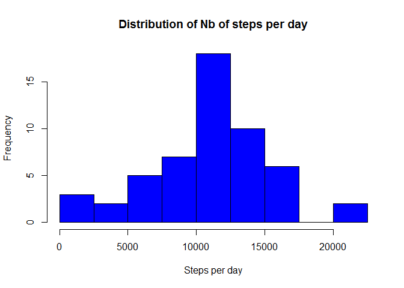
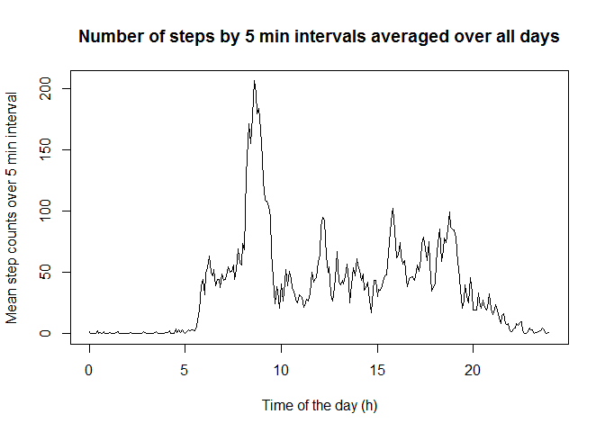
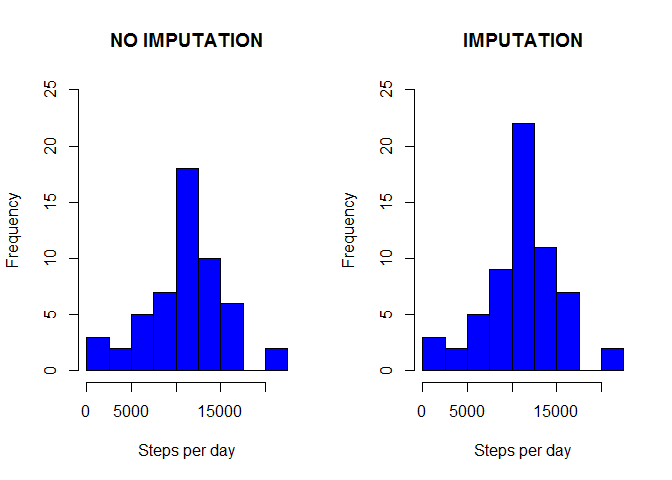
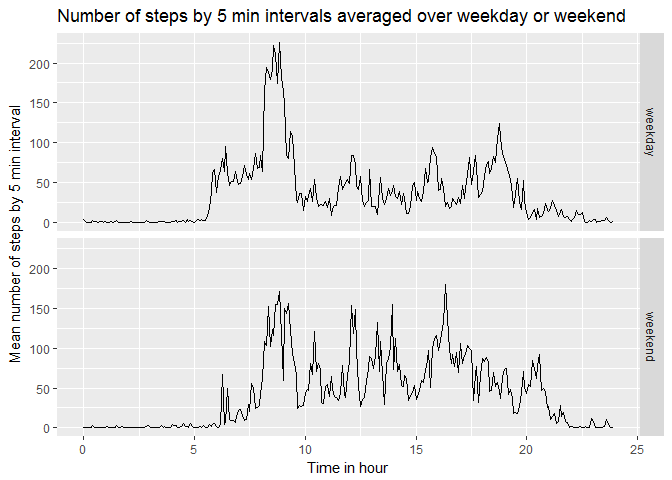

# Reproducible Research: Peer Assessment 1
TVD  
2017, January 2nd  


## Loading and preprocessing the data

Unzip and load the data in "activity" data table

```r
unzip("activity.zip",exdir = ".")
activity <- read.csv("activity.csv")
```

Look at the structure of the data table

```r
dim(activity)
```

```
## [1] 17568     3
```

```r
str(activity)
```

```
## 'data.frame':	17568 obs. of  3 variables:
##  $ steps   : int  NA NA NA NA NA NA NA NA NA NA ...
##  $ date    : Factor w/ 61 levels "2012-10-01","2012-10-02",..: 1 1 1 1 1 1 1 1 1 1 ...
##  $ interval: int  0 5 10 15 20 25 30 35 40 45 ...
```

```r
summary(activity)
```

```
##      steps                date          interval     
##  Min.   :  0.00   2012-10-01:  288   Min.   :   0.0  
##  1st Qu.:  0.00   2012-10-02:  288   1st Qu.: 588.8  
##  Median :  0.00   2012-10-03:  288   Median :1177.5  
##  Mean   : 37.38   2012-10-04:  288   Mean   :1177.5  
##  3rd Qu.: 12.00   2012-10-05:  288   3rd Qu.:1766.2  
##  Max.   :806.00   2012-10-06:  288   Max.   :2355.0  
##  NA's   :2304     (Other)   :15840
```

Modify date and interval (which is of format HHMM, 2345 meaning 23:45 ...)
Transform date from factors to date object

```r
activity$date <- as.Date(activity$date,"%Y-%m-%d")
```

make "interval2", a 4 character long string representing interval in HHMM

```r
interval2 <- as.character(activity$interval)
interval2 <- paste("000",interval2,sep="")
interval2 <- substr(interval2,nchar(interval2)-3,nchar(interval2))
```


convert date and interval2 into datetime as POSIXlt format

```r
datetime <- paste(activity$date,interval2,sep=" ")
activity$datetime <- as.POSIXlt(datetime,"%Y-%m-%d %H%M",tz = "GMT")
```

Compute the time of the day as count in min

```r
activity$timemin <- activity$datetime$hour*60 + activity$datetime$min
```

## What is mean total number of steps taken per day?

Calculate the total number of steps taken per day

```r
Daily_steps <- aggregate(steps~date,activity,sum)
summary(Daily_steps)
```

```
##       date                steps      
##  Min.   :2012-10-02   Min.   :   41  
##  1st Qu.:2012-10-16   1st Qu.: 8841  
##  Median :2012-10-29   Median :10765  
##  Mean   :2012-10-30   Mean   :10766  
##  3rd Qu.:2012-11-16   3rd Qu.:13294  
##  Max.   :2012-11-29   Max.   :21194
```

Make a histogram of the total number of steps taken each day

```r
hist(Daily_steps$steps,xlab="Steps per day",main="Distribution of Nb of steps per day",xlim = c(0,22500),breaks = seq(0,22500,by=2500),col="blue" )
```

<!-- -->

Calculate and report the mean and median of the total number of steps taken per day.
Mean Nb of steps per day

```r
mean_step <- round(mean(Daily_steps$steps))
mean_step
```

```
## [1] 10766
```

Median Nb of steps per day

```r
median_step <- round(median(Daily_steps$steps))
median_step
```

```
## [1] 10765
```

## What is the average daily activity pattern?

Make a time series plot (i.e. type = "l") of the 5-minute interval (x-axis) and the average number of steps taken, averaged across all days (y-axis)

```r
Daily_pattern <- aggregate(steps~timemin,activity,mean)
plot(Daily_pattern$timemin/60,Daily_pattern$steps,type="l",xlim=c(0,24),xlab = "Time of the day (h)", ylab="Mean step counts over 5 min interval",main="Number of steps by 5 min intervals averaged over all days")
```

<!-- -->

Which 5-minute interval, on average across all the days in the dataset, contains the maximum number of steps?

```r
maxsteps <- max(Daily_pattern$steps)
maxtime <- Daily_pattern$timemin[Daily_pattern$steps==maxsteps]
```

The interval with max average steps count is at 8:35

## Imputing missing values

Note that there are a number of days/intervals where there are missing values (coded as NA). The presence of missing days may introduce bias into some calculations or summaries of the data.

Calculate and report the total number of missing values in the dataset (i.e. the total number of rows with NAs)

```r
sum(is.na(activity$steps))
```

```
## [1] 2304
```

Devise a strategy for filling in all of the missing values in the dataset. The strategy does not need to be sophisticated. For example, you could use the mean/median for that day, or the mean for that 5-minute interval, etc.

The missing values will be replaced by a value of the same interval picked from a random different day.

```r
nalist <- is.na(activity$steps)
steps <- activity$steps
for (i in 1:nrow(activity)){
  if (is.na(activity$steps[i])){
    steps[i] <- sample(activity$steps[!nalist&activity$interval==activity$interval[i]],1)
  }
}
```

Check that there is no NAs in steps

```r
sum(is.na(steps))
```

```
## [1] 0
```


Create a new dataset that is equal to the original dataset but with the missing data filled in.

```r
activity_nona <- activity[,c("timemin","date","datetime")]
activity_nona <- cbind(steps,activity_nona)
```


Make a histogram of the total number of steps taken each day and Calculate and report the mean and median total number of steps taken per day. Do these values differ from the estimates from the first part of the assignment? What is the impact of imputing missing data on the estimates of the total daily number of steps?

Reuse the same code just replacing the name of data table

```r
Daily_steps_nona <- aggregate(steps~date,activity_nona,sum)
```

Lets look at the distribution of total Nb of steps per day, with or without imputation.

```r
par(mfrow=c(1,2))
hist(Daily_steps$steps,xlab="Steps per day",main="NO IMPUTATION",xlim = c(0,22500),ylim=c(0,25),breaks = seq(0,22500,by=2500),col="blue" )
hist(Daily_steps_nona$steps,xlab="Steps per day",main="IMPUTATION",xlim = c(0,22500),ylim=c(0,25),breaks = seq(0,22500,by=2500),col="blue" )
```

<!-- -->


Calculate and report the mean and median of the total number of steps taken per day

Mean Nb of steps per day

```r
mean_step_nona <- mean(Daily_steps_nona$steps)
mean_step_nona
```

```
## [1] 10958.44
```

Median Nb of steps per day

```r
median_step_nona <- median(Daily_steps_nona$steps)
median_step_nona
```

```
## [1] 11162
```

The mean and the median are quite the same after imputation.

Both from summary and plot, we see that this imputation method lead to an increase in the most frequent steps per day with no great modification of the distribution otherwize.

## Are there differences in activity patterns between weekdays and weekends?

For this part the weekdays() function may be of some help here. Use the dataset with the filled-in missing values for this part.

Create a new factor variable in the dataset with two levels - "weekday" and "weekend" indicating whether a given date is a weekday or weekend day.
Note that "samedi" and "dimanche" stand for "saturday" and "sunday" in french (the language used in my settings)

```r
activity_nona$weekend <- weekdays(activity_nona$datetime)=="samedi" |weekdays(activity_nona$datetime)=="dimanche"
table(activity_nona$weekend)
```

```
## 
## FALSE  TRUE 
## 12960  4608
```

```r
activity_nona$weekend <- factor(activity_nona$weekend,levels=c(F,T),labels=c("weekday","weekend"))
```

Make a panel plot containing a time series plot (i.e. type = "l") of the 5-minute interval (x-axis) and the average number of steps taken, averaged across all weekday days or weekend days (y-axis). See the README file in the GitHub repository to see an example of what this plot should look like using simulated data.

```r
Daily_pattern_week <- aggregate(steps~timemin+weekend,activity_nona,mean)
library(ggplot2)
g <- ggplot(Daily_pattern_week,aes(timemin/60,steps))
g + geom_line() + facet_grid(.~weekend) + labs(x = "Time in hour",title="Number of steps by 5 min intervals averaged over weekday or weekend",y="Mean number of steps by 5 min interval")
```

<!-- -->

There is a clear difference in the pattern between weekday and weekend.
In weekday we see 4 peaks in activity. One around 9 AM (on the way to work?), one around 12:30 (lunchtime?), one around 16:00 (coffee break?) and one around 19:00 (on the way home?).

In weekend, the data is very noisy and it is much more difficult to draw conclusions.
